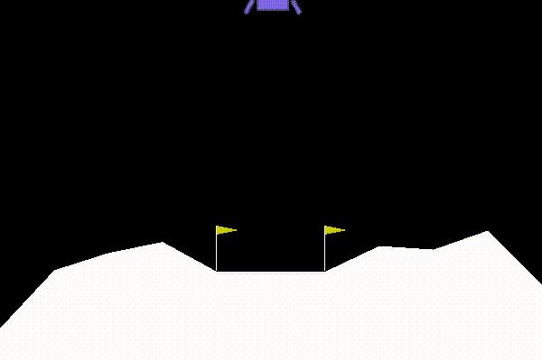
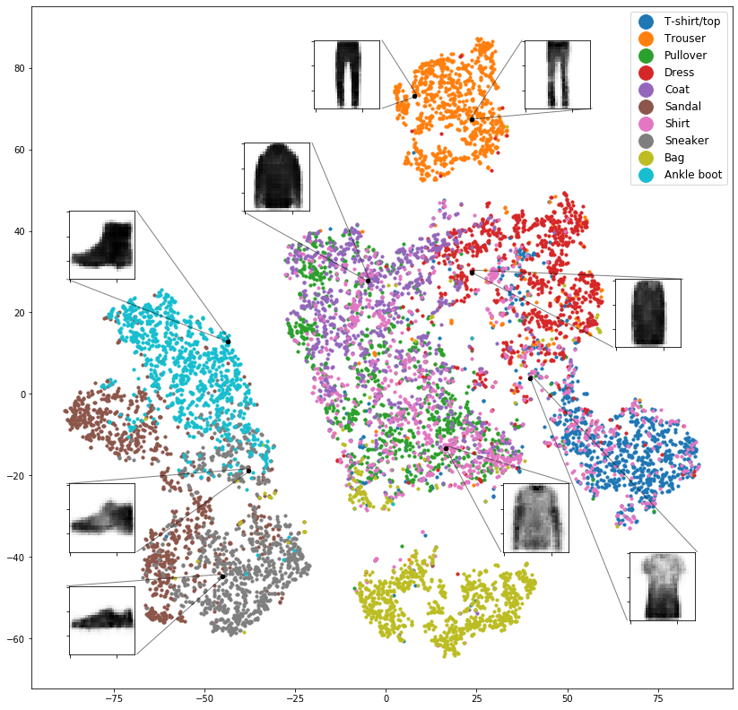
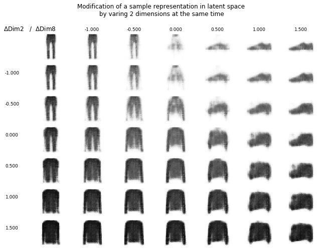
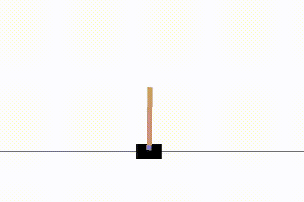

# Neural Networks and Deep Learning Homeworks
***

This repository contains the notebooks from the homeworks of the course Neural networks and Deep learning from UNIPD. 
All of the tasks needed to construct a deep learning framework in pytorch to solve specific problems.

The homeworks are so divided:

## Homework 1
It is divided in two further tasks that both explore the building of a supervised learning neural network:
+ A simple regression task, with a 1 dimensional target function done on a ad-hoc dataset
+ A simple classification task done on the FashionMNIST dataset

## Homework 2 
The main objective was to explore unsupervised learning tecniques in pytorch, such as the development of an Autoencoder. The dataset used is still FashionMNIST.
The notebook also explores the latent space organization, the possibility of coupling autoencoders and supervised learning and the development of a variational autoencoder.

  
  
  

## Homework 3 
Development of a reinforcement learning algorithm usign the Q-learning approach. The task solved by the algorithm are all from the gym python enviroment.

